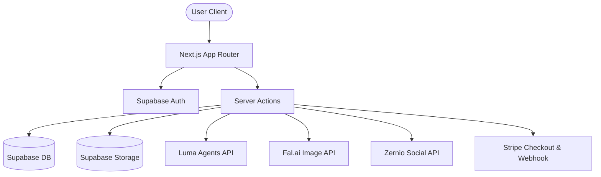

# AI Influencer Generator & Auto Post Scheduler: Platform Documentation Manual

Welcome to the official technical documentation manual for the **AI Influencer Generator & Auto Post Scheduler** application. This document outlines the architectural components, integrations, data schemas, server actions, and workflows that make this state-of-the-art SaaS platform function.

---

## 1. Platform Architectural Overview

This platform is a Next.js App Router application built on a premium tech stack consisting of **Next.js 16**, **Supabase Database & Storage**, **Tailwind CSS/Vanilla CSS glassmorphic aesthetics**, **Stripe Payment Gateway**, and **Zernio multi-platform social APIs**. 

The system enables users to:
1. **Design & Build AI Influencers**: Generate consistent-character portraits and full-body renders using highly customized prompts and advanced generation models.
2. **Generate Social Media Content**: Create campaign assets, high-converting copy, hashtags, and visual posts tailored to specific influencers.
3. **Connect Multiple Channels**: Interface with Instagram, LinkedIn, YouTube, TikTok, and Pinterest.
4. **Manage an Interactive Calendar Queue**: Schedule, re-schedule, edit, and queue posts on an intuitive calendar dashboard with detailed footer analytics.
5. **Manage Billing & Credits**: Upgrade plan levels seamlessly with dynamic Stripe recurring billing and credit refill systems.



---

## 2. Core Architectural Subsystems

### A. AI Influencer Studio & Generation
Located in [app/actions/influencers.ts](file:///c:/Users/shruti%20sania/ai-influencer-generator/app/actions/influencers.ts), the AI Influencer Studio allows users to create consistent models.
- **Generation Flow**: The application utilizes [Fal.ai](https://fal.ai) (configured via `FAL_KEY`) or fallback pollination engines to create a consistent dual-portrait: a portrait/close-up avatar and a full-body model render based on variables (body type, skin tone, hair style, vibe, and eye color).
- **Buffer-Storage Pipelines**:
  1. The server downloads generated image buffers.
  2. Uploads them securely to Supabase Storage inside the folder `${userId}/${timestamp}_(portrait/fullbody).jpg`.
  3. Returns a signed storage URL.
  4. Saves record metadata (name, gender, vibe, visual styles, and image paths) to the `models` table.
- **Credit Rule**: Creating an influencer deducts exactly **50 credits**. The system performs strict validation *before* calling generative APIs, safeguarding token usage if a profile has insufficient credits.

### B. Post Generation Engine
The Post Generator enables creators to produce media campaigns for their models.
- **Caption & Copywriter**: Integrates premium prompts to generate high-converting subtitles, hooks, call-to-actions, and trending hashtags.
- **Visual Synthesis**: Generates high-fidelity images matching the model's visual persona and aspect ratio constraints.
- **Credit Rule**: Creating a post deducts exactly **20 credits** from the user's balance.

### C. Multi-Platform Social Scheduler (Zernio API)
Configured in [app/actions/social.ts](file:///c:/Users/shruti%20sania/ai-influencer-generator/app/actions/social.ts), the social subsystem links the scheduler to real social accounts.
- **Zernio Profile Alignment**: Generates unique profiles for every authenticated user via `getOrCreateZernioProfile` to isolate account data.
- **Unified OAuth Linker**:
  - Requesting connectivity initiates `getConnectUrl(platform)`.
  - Generates authentic callback redirect sequences for platforms like Instagram, TikTok, LinkedIn, YouTube, and Pinterest.
  - If no Zernio API key is set, the system initiates a **Mock OAuth Link simulator** returning `mock-oauth://` protocols to simulate seamless integration!
- **Presigned Upload Pipeline**: Before publishing, images are sent to Zernio's presigned S3 upload endpoints `/media/presign`, downloaded, sent back to target APIs, and successfully published or scheduled.

### D. Interactive Calendar Dashboard & Insights
The calendar in [app/(dashboard)/dashboard/calendar/page.tsx](file:///c:/Users/shruti%20sania/ai-influencer-generator/app/%28dashboard%29/dashboard/calendar/page.tsx) handles automated content queueing.
- **Draft Selection Dialog**: Click a calendar day to trigger a overlay that allows selecting existing unpublished drafts, editing captions/time configurations, and scheduling immediately.
- **Drag-to-Replan**: Enables quick scheduling adjustments.
- **Aesthetic Hover Previews**: Hover over scheduled slots to render visual image thumbnails.
- **Queue Analytics Footer**:
  - Displays weekly/monthly schedule volumes.
  - Renders visual breakdowns of platform distributions (Instagram, TikTok, etc.).

### E. Stripe Subscriptions & Credit Gateway
Configured in [app/actions/stripe.ts](file:///c:/Users/shruti%20sania/ai-influencer-generator/app/actions/stripe.ts) and [settings/page.tsx](file:///c:/Users/shruti%20sania/ai-influencer-generator/app/%28dashboard%29/dashboard/settings/page.tsx), this handles SaaS monetization.
- **Stripe Checkout Action**: Uses inline dynamic price passing (`price_data.recurring: { interval: 'month' }`) to eliminate the overhead of creating products manually in Stripe's developer dashboard.
- **Webhook Endpoint**: The route handler in [api/webhooks/stripe/route.ts](file:///c:/Users/shruti%20sania/ai-influencer-generator/app/api/webhooks/stripe/route.ts) handles `checkout.session.completed` events, updating user statuses and adding recurring credits.
- **Schema-Agnostic Fallback**:
  - [ensureUserProfile](file:///c:/Users/shruti%20sania/ai-influencer-generator/utils/ensure-profile.ts) is engineered to bypass missing column errors on unmigrated Supabase databases by defaulting to local sandboxed parameters.
  - An **interactive checkout simulator modal** handles testing when Stripe keys are unconfigured, allowing users to enter mock card data, process transactions with a loader, and update their balances.

---

## 3. Database Schema Models (SQL)

All data structures are defined in [supabase_setup.sql](file:///c:/Users/shruti%20sania/ai-influencer-generator/supabase_setup.sql).

### A. Users Table (`public.users`)
Manages subscription states, Stripe references, and credit balances.
```sql
CREATE TABLE public.users (
    id UUID PRIMARY KEY REFERENCES auth.users ON DELETE CASCADE,
    email TEXT,
    full_name TEXT,
    avatar_url TEXT,
    credits INTEGER DEFAULT 300,                  -- Default credit count for Free plan entry
    subscription_tier TEXT DEFAULT 'free',        -- 'free', 'standard', 'pro'
    subscription_status TEXT DEFAULT 'inactive',  -- 'active', 'inactive', 'canceled'
    stripe_customer_id TEXT,
    stripe_subscription_id TEXT,
    updated_at TIMESTAMP WITH TIME ZONE
);
```

### B. Models Table (`public.models`)
Stores custom AI Influencers.
```sql
CREATE TABLE public.models (
    id UUID PRIMARY KEY DEFAULT gen_random_uuid(),
    user_id UUID REFERENCES public.users(id) ON DELETE CASCADE,
    name TEXT NOT NULL,
    gender TEXT,
    body_type TEXT,
    skin_tone TEXT,
    age_range TEXT,
    hair_style TEXT,
    hair_color TEXT,
    eye_color TEXT,
    vibe TEXT,
    prompt TEXT,
    portrait_url TEXT,     -- Supabase storage URL
    full_body_url TEXT,    -- Supabase storage URL
    created_at TIMESTAMP WITH TIME ZONE DEFAULT timezone('utc'::text, now()) NOT NULL
);
```

### C. Posts Table (`public.posts`)
Stores generated visual assets, draft states, and scheduled times.
```sql
CREATE TABLE public.posts (
    id UUID PRIMARY KEY DEFAULT gen_random_uuid(),
    user_id UUID REFERENCES public.users(id) ON DELETE CASCADE,
    model_id UUID REFERENCES public.models(id) ON DELETE CASCADE,
    prompt TEXT NOT NULL,         -- Stores caption, scheduledAt, and publish status as JSON
    image_url TEXT,               -- Supabase storage URL
    aspect_ratio TEXT,
    created_at TIMESTAMP WITH TIME ZONE DEFAULT timezone('utc'::text, now()) NOT NULL
);
```

### D. Social Accounts Table (`public.social_accounts`)
Stores connected profiles synced from Zernio.
```sql
CREATE TABLE public.social_accounts (
    id UUID PRIMARY KEY DEFAULT gen_random_uuid(),
    user_id UUID REFERENCES public.users(id) ON DELETE CASCADE,
    platform TEXT NOT NULL,       -- 'instagram', 'linkedin', etc.
    profile_id TEXT NOT NULL,     -- Zernio profile key
    account_id TEXT NOT NULL,     -- Zernio account ID
    account_name TEXT,
    avatar_url TEXT,
    created_at TIMESTAMP WITH TIME ZONE DEFAULT timezone('utc'::text, now()) NOT NULL,
    CONSTRAINT unique_user_platform_account UNIQUE (user_id, platform, account_id)
);
```

---

## 4. Key Directory & Code File Mappings

* **Database & Configurations**:
  * [supabase_setup.sql](file:///c:/Users/shruti%20sania/ai-influencer-generator/supabase_setup.sql): Supabase SQL schema initialization.
  * [.env.local](file:///c:/Users/shruti%20sania/ai-influencer-generator/.env.local): Environment credentials (Stripe, Supabase, Luma, Fal, Zernio).
* **Server Actions**:
  * [app/actions/stripe.ts](file:///c:/Users/shruti%20sania/ai-influencer-generator/app/actions/stripe.ts): Stripe checkout creation, verification, and mock upgrades.
  * [app/actions/social.ts](file:///c:/Users/shruti%20sania/ai-influencer-generator/app/actions/social.ts): OAuth linker, Zernio account synchronizers, and media creators.
  * [app/actions/influencers.ts](file:///c:/Users/shruti%20sania/ai-influencer-generator/app/actions/influencers.ts): Influencer visual generators, credit validators, and post managers.
* **API Handlers**:
  * [app/api/webhooks/stripe/route.ts](file:///c:/Users/shruti%20sania/ai-influencer-generator/app/api/webhooks/stripe/route.ts): Stripe asynchronous webhook handler.
* **Helper Utilities**:
  * [utils/ensure-profile.ts](file:///c:/Users/shruti%20sania/ai-influencer-generator/utils/ensure-profile.ts): DB safety validator & schema-agnostic fallback.
* **Frontend Pages & Layouts**:
  * [app/(dashboard)/dashboard/settings/page.tsx](file:///c:/Users/shruti%20sania/ai-influencer-generator/app/%28dashboard%29/dashboard/settings/page.tsx): Billing, active credit meter, pricing cards, and credit card sandbox simulator.
  * [components/DashboardSidebar.tsx](file:///c:/Users/shruti%20sania/ai-influencer-generator/components/DashboardSidebar.tsx): Layout navigation including dynamic tier badges.
  * [app/(dashboard)/dashboard/calendar/page.tsx](file:///c:/Users/shruti%20sania/ai-influencer-generator/app/%28dashboard%29/dashboard/calendar/page.tsx): Calendar interface and scheduling controls.

---

## 5. Operations & Execution Guide

### Running Locally
To launch the developer hot-reloading server:
```bash
npm run dev
```

### Deploying the Stripe Webhook Tunnel
To forward Stripe events to your local server in development, run the Stripe CLI:
```bash
stripe listen --forward-to localhost:3000/api/webhooks/stripe
```
Then, save the returned webhook secret as `STRIPE_WEBHOOK_SECRET` in your `.env.local` file.
